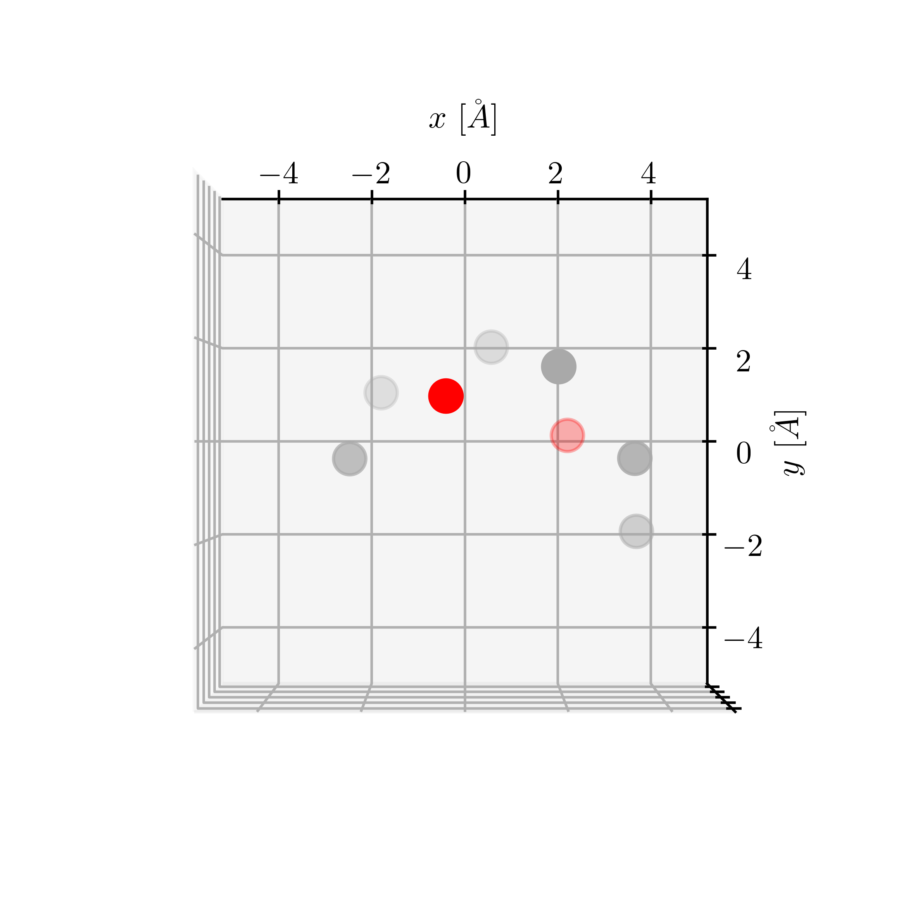

# Computing dipole orientation for asymmetric solvent systems

This code uses optimized structures from DFT calculations at the B3LYP/aug-cc-pVDZ level to quantify the "asymmetry" of solvent molecules in our study, which we find to be correlated with higher exchange current densities ($j_0$).

The extracted Cartesian coordinates of the optimized structures are stored in the `.txt` files in the `optimized-structures` directory. These values are automatically read in by the code. Furthermore, the contents of these files can be easily copied and pasted into Gaussian input files for other researchers to view themselves.

## Instructions

Download `plane.ipynb` and the `optimized-structures` directory. As long as you have all the required packages, you should be able to run the code without any issues.

If you have not used Jupyter notebooks much before, you may need to install [`ipympl`](https://github.com/matplotlib/ipympl) to enable interactive plots and [`ipytest`](https://github.com/chmp/ipytest) to run the unit tests.

## Procedure for finding orientations

In particular, we quantify asymmetry by measuring the orientation of the dipole moment of a system containing one solvent molecule and one lithium ion. We compute the dipole orientation through the following process:

1. Isolate the carbon (gray) and oxygen (red) atoms that make up the "backbone" of the solvent molecule.

    

2. Find the best-fit plane for the backbone atoms.

    

3. Project the dipole moment (blue) and vector connecting the two oxygen atoms in the solvent (red, the “oxygen vector”) onto best-fit plane. The original vectors are shown with solid lines, while the projected vectors are shown with dashed lines.

    

4. Find the acute angle between the dipole moment (blue) and the in-plane normal (black, dashed) to the oxygen vector.

    
